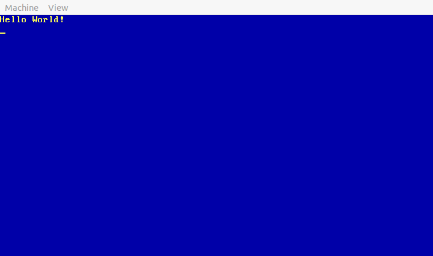

## Small Two Stage Bootloader and C Kernel (WIP)

I know a lot about 16 real mode and boot sectors but not everything about it. I
am doing this small project to learn even more, after all knowledge is power. This
project will show you how to write a two stage boot loader written in NASM (Net-wide Assembler), also with a simple kernel
written in pure C.

### Screen Shots

### Build and Run Instructions

 - Install required tools for Debian based distros below.

    1 - build-essential\
    2 - nasm\
    3 - qemu-system (installs everything for qemu).

 - How to compile?

    1 - make run (builds and runs in qemu).\
    2 - make debug (builds and runs in qemu with gdb debugging).\
    3 - make disk - builds floppy.img (you can write that to a floppy).

### TODO

 - [x] - First stage boot loader (for loading second stage).
 - [x] - Second stage boot loader (for loading kernel).
 - [x] - Simple starter kernel written in C.
 - [x] - Add my simple file system (list of LBA starts and count of sectors).
 - [x] - Fix kernel not loading again.
 - [ ] - Fix ISRs and IRQs so they work (they cause a kernel panic).
 - [ ] - Add keyboard input handler.

### Developer

 - Philip R. Simonson (aka 5n4k3)
 - With help from people on osdev.org, Michael Petch, Octocontrabass, and more.

### License

 - None [ATM] (At This Moment)
